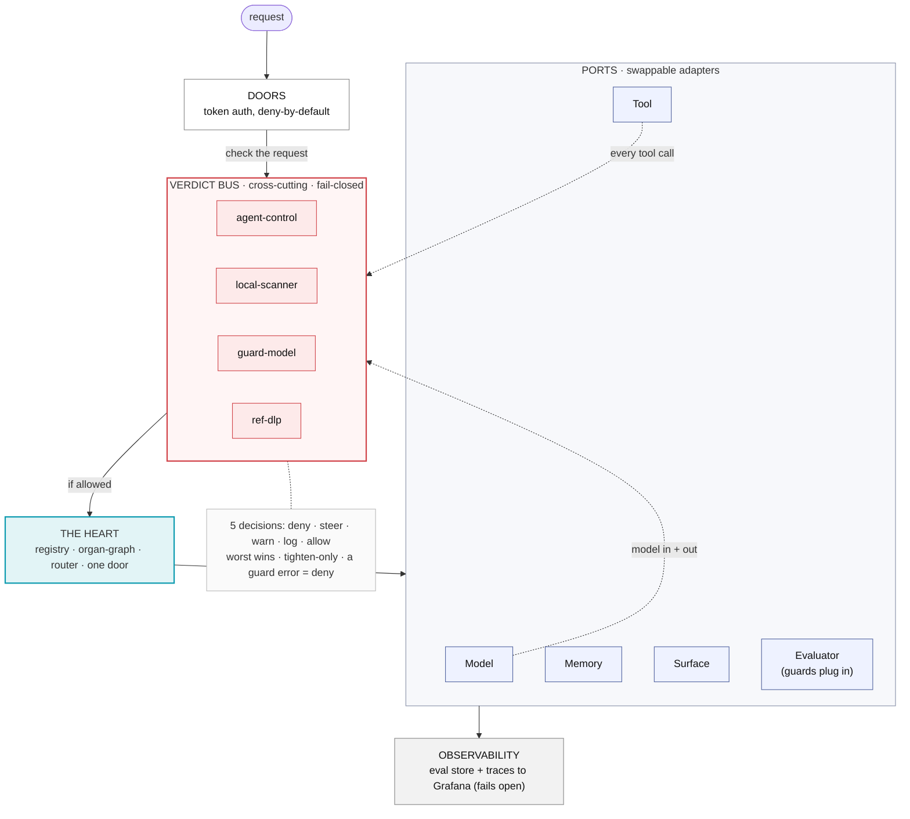

# The AI Body

A governed local agent foundation: one personal AI system rebuilt as **five swappable ports
behind a deterministic heart**, where every model call, tool call, memory write, and answer
passes a **fail-closed gate** on the way through. Add anything later by writing one manifest,
the core never changes.

Not a framework, not an LLM boss-agent. A small, owned coordinator that wires owned parts
together under one set of rules.

**What it proves** (for a fast read):

- **Fail-closed governance, two tiers.** Every call crosses a verdict bus in-process, and the model's
  only network route is an out-of-process gateway. If a guard can't decide, or a guard is down, the
  answer is *deny*, never *allow*.
- **Native modularity.** All five ports have a real second adapter, each added by one `register()` with
  zero core edits, the whole thesis is "add a capability without touching the middle."
- **Owned, portable memory.** An append-only ledger with hybrid recall, migrated with a parity gate and
  a proven, reversible cutover, no external store is ever the source of truth.
- **Governed autonomy.** Two caged workers (read-only researcher + write-capable coder) run behind
  per-worker tool allowlists, deny-by-default delegation, and learning that only flows inward.

**60-second look:** `python3 accept.py` runs all 15 definition-of-done checks and prints a green board;
the [live architecture page](https://siddiqitaha.github.io/ai-body/) is the visual. Details below.



The verdict bus is **not** a downstream port, it is a band the flow passes through at the door,
at every model / tool / memory call (in and out), and on the answer. The Evaluator port is just
where guards plug in; the bus that calls them is cross-cutting.

### Two enforcement tiers (defense in depth)

The bus above is **tier 1**: fast, in-process, but it lives inside the agent, code that skips the
heart skips the bus. **Tier 2** is an out-of-process gateway (`gateway.py`) that owns the only
network route to the model and independently consults Agent Control before forwarding:

```
agent ─▶ [tier 1: heart bus, in-proc, all 4 guards] ─▶ [tier 2: LLM gateway, out-of-proc]
                                                              │ asks Agent Control :19381
                                                              ├ allow ─▶ model :8012
                                                              └ deny / AC down ─▶ 403, model never reached
```

Tier 1 is fast and catches most things; tier 2 is the choke point a compromised agent cannot
bypass. Live-proven: a benign prompt forwards to the model, a secrets-file prompt is blocked by
the gateway before the model is ever called. Point the Model adapter's base at the gateway to arm it:
`AIBODY_MODEL_BASE=http://127.0.0.1:19099/v1 AIBODY_GUARD_MODE=enforce python3 serve.py` runs the
network door behind BOTH tiers (the in-process bus in enforce + the out-of-process gateway).

Full visual: **[the live architecture page](https://siddiqitaha.github.io/ai-body/)** (source: [`docs/index.html`](docs/index.html)).

---

## The seven rules no adapter may break

1. **Fail closed.** A gate that can't decide, or whose module is missing, denies.
2. **Own the data.** The memory ledger is ours, on-box, append-only. No external store is the source of truth.
3. **Govern on the port, not in the adapter.** Every call passes the gate at the contract boundary.
4. **Tighten-only automation.** Automatic actors may only make things stricter; loosening is a human act with a receipt.
5. **Re-gate on change.** A scheduled or looped action is re-checked at fire time against current calibration.
6. **Nothing lands ungoverned.** New models/tools/skills pass quarantine → scan → register-by-fingerprint → sandbox.
7. **Learning drains inward.** What a worker learns is proposed to the brain and stored in our ledger, or not at all.

---

## The five ports (contracts)

| Port | Contract | Reference adapter today | Governance on the port |
|---|---|---|---|
| **Model** | `complete` / `embed` / `capabilities` | `LocalModel` (local tier) + optional `CloudModel` (cloud tier) | tier-aware routing: private-by-default → local; only non-sensitive may offload; DLP scrub on egress, never send raw |
| **Memory** | `remember` / `recall` / `supersede` / `invalidate` | `BrainMemory`, notes + FTS + vectors, fused by RRF | scan-on-write, per-scope filter, append-only |
| **Tool** | `list` / `invoke` | `status` + `repo_ls` (read) + `repo_write` (confined write), admitted through the acquire funnel | fingerprint-admitted (invariant 6), fail-closed gate before every invoke; unknown → deny |
| **Surface** | `receive` | `LocalSurface` (in-process token door) + `HTTPSurface` (network door) | Bearer auth, principal via header (never defaulted), missing principal → deny |
| **Evaluator** | `evaluate → Verdict{deny,steer,warn,log,allow}` | the verdict bus (four guards, below) | tighten-only; enforcement error → deny |
| *(Worker)* | `run(task, cage)` | `ResearcherWorker` (read-only) + `CoderWorker` (governed write, no exec) | per-worker tool allowlist (the cage), delegation deny-by-default, learning drains inward |

**The verdict bus**, four guards, each returns one of five decisions; the worst wins, evaluators
may only tighten, and any guard that errors on an enforcement path is treated as `deny`:

- `agent-control`, the live Agent Control server on `:19381` (fail-closed)
- `local-scanner`, a local safety scanner on `:18970` (fail-closed). **A token alone is not enough**: the
  reference scanner authenticates by source/path, so a plain host process gets 401/403 whatever token it
  sends, and arming this adapter from the host denies every call. The working route is to attach the
  scanner as a control on the control plane, so `agent-control` below returns a verdict that already
  carries the scanner's (measured live, see the adapter docstring)
- `guard-model`, a local model judging SAFE/UNSAFE (a `judge` can be injected, e.g. DefenseClaw). **Calibrated**: Se 1.0 / Sp 1.0 on 55 labeled cases (`calibration_set.py`), so `enforce` mode (blocking) is authorized; ships in `observe` by default. Enforce is proven offline: UNSAFE → deny, SAFE → allow, a judge error fails closed
- `ref-dlp`, a deterministic secret-marker scan

---

## Run it

```bash
# one-command health check: all 15 definition-of-done boxes, exits nonzero if any fail
python3 accept.py

# the unit suites (93 tests, offline)
for t in test_skeleton test_phase1 test_phase2 test_phase3 test_phase4 test_phase5 test_phase6 test_phase7 test_phase8 test_phase9 test_phase10 test_phase11 test_phase12 test_phase13; do
  python3 $t.py; done

# the governed walk through the live Agent Control server (needs AC keys in env)
python3 phase1.py

# the memory rebuild + parity gate (read-only against the source memory store)
python3 migrate.py 0            # 0 = all notes; a number = sample that many
python3 parity_harness.py 150   # OLD brain vs NEW core, same sample
python3 cutover_live.py         # prove the full cutover lifecycle on the real notes (writes a receipt)
```

`accept.py` is the gate that says *is the foundation still proven?*, end-to-end walk, fail-closed
self-test, trace + eval store, memory parity, DLP block, the modularity test, a caged worker
delegation, and `doctor`. All green = proven.

---

## File map

| File | What it is |
|---|---|
| `ports.py` | the five contracts + the `Decision`/`Verdict` vocabulary + the Worker port |
| `heart.py` | registry, organ-graph, router, one door, the verdict bus, the `Cage`, `delegate` |
| `adapters.py` | one reference adapter per port + the four evaluators + the caged worker |
| `manifest.py` | the small declaration that makes adding anything a config act |
| `memory.py` | `BrainMemory`, append-only notes + FTS + vectors, hybrid recall (RRF) |
| `migrate.py` | memory migration with the parity gate (read-only toward the source memory store) |
| `parity_harness.py` | the honest old-vs-new recall comparison |
| `cutover.py` | shadow dual-write + rollback (the strangler-fig cutover mechanism) |
| `cutover_live.py` | runs the full cutover lifecycle on the real notes end to end + writes a receipt |
| `acquire.py` | the acquire funnel (invariant 6): quarantine → scan → fingerprint → sandbox; `build_toolbox()` arms the live tool port |
| `router.py` | tier-aware model routing: private-by-default → local, non-sensitive may offload to cloud, fail-closed |
| `serve.py` | run the governed stack over HTTP (the `HTTPSurface` network door) |
| `observ.py` | the eval store (verdicts) + OTLP trace export (fails open) |
| `doctor.py` | enumerates every guard, fails nonzero if none is provably live |
| `calibrate.py` | the promote-before-blocking gate (Se/Sp ≥ 0.90 on ≥ 50 labels) |
| `phase1.py` | wires the governed stack; `build_governed()` |
| `accept.py` | the one-command definition-of-done gate |
| `test_*.py` | 14 suites, 93 tests |

---

## Status

- **Foundation feature-complete.** All five ports have a real adapter; governed, monitored,
  with a caged-worker loop and a tested cutover mechanism.
- **Invariant 6 armed.** The live tool port now runs through the acquire funnel, so every tool is
  quarantined → scanned → fingerprinted before it can run, and the digest is re-checked at invoke
  (a swap after admission is denied). Second real tool `repo_ls` was added the one-adapter way
  (`admit` + `register`), zero core edits, proving the modularity contract on the Tool port.
- **Tier-aware model routing.** The heart routes each model call by tier: private-by-default, so a
  call stays on the local tier unless the request opts out; only non-sensitive calls may offload to
  a cloud tier; a sensitive call with no local model is refused, never leaked. The `CloudModel`
  adapter adds a second line, refusing secret-bearing input outright. Adding the cloud row is one
  `register()`, and an untagged single-model fleet behaves exactly as before.
- **Second surface (network door).** `HTTPSurface` makes the governed stack callable over HTTP with
  the same fail-closed contract as the local door (Bearer auth, principal via `X-Principal`, missing
  principal denied, bad token 401 before the heart is reached). `python3 serve.py` runs it. All five
  ports now have two adapters or a proven second-adapter path, the modularity claim holds on each.
- **Both enforcement tiers armed together.** `serve.py` can run the network door with the guard model
  in `enforce` (tier-1 bus blocks UNSAFE) AND the model routed through the tier-2 gateway (out-of-process
  choke point), via `AIBODY_GUARD_MODE` and `AIBODY_MODEL_BASE`. The guard model takes a pluggable
  `judge`, so DefenseClaw or any other judge can back it.
- **Two real caged workers.** A `researcher` (read-only: recall + `repo_ls`) and a `coder` (reads, plus
  a governed `repo_write` confined to a sandbox, every write DLP-gated and fingerprint-admitted, and
  no exec). Each worker has its own tool allowlist enforced by the cage, only the heart may call them
  (delegation is deny-by-default, so workers cannot call each other), and both drain learning inward.
  `build_governed(with_workers=True)` registers them. This mirrors the running multi-agent fleet
  (researcher + coder) and tightens it: capability arrives only behind the cage, the gate, and the funnel.
- **Memory:** 1930 notes migrated into a side copy; recall parity with the source memory store confirmed
  (hit@12 0.913 = 0.913, delta 0.000).
- **Cutover proven live + reversible.** `cutover_live.py` ran the full strangler-fig lifecycle on all
  1930 real notes: shadow dual-write (0 failures), `compare_recall` parity on real queries (overlap
  1.0, 0 divergence), flip so the candidate serves reads, then rollback, reads intact both ways,
  nothing destroyed (receipt in `cutover-receipt.json`). The live source-daemon flip stays a
  deliberate, separately-backed-up user act; the mechanism it would use is now proven end to end.
- **Tests:** 93/93 unit + `accept.py` 15/15 green.

### Waiting on a human (each a single step)

- Label 50-100 real cases → `calibrate.py` promotes the guard model from observe to blocking.
- Attach your scanner as a control on the control plane → its verdict rides in through `agent-control`
  (a `SCANNER_GATEWAY_TOKEN` alone will not arm the direct adapter, see the note above).
- Flip the live source-daemon when chosen → the cutover mechanism is proven and reversible (above).

From here the AI Body grows by adding the next worker, tool, model, or surface, one adapter at a time.
